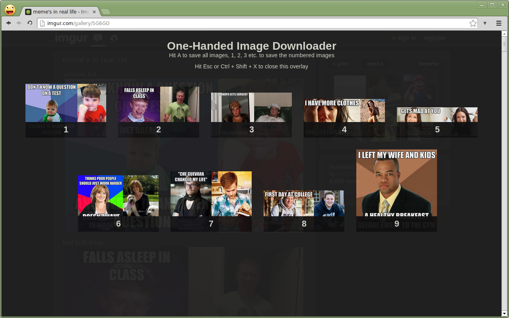

# One-Handed Image Downloader
## A mouseless, fast & easy way to save pictures from any website
Maybe you know this: Your browsing images, e.g. like on imgur, and suddenly you want to save an image. But your right hand is busy stirring your coffee, petting your cat or whatever.

Maybe you're just some kind of homerow junkie that is repulsed by the thought
of having to use the mouse.

Don't worry, I'm not here to judge but to help. This is for you.

### Intention
The goal of this extension is to allow for one-handed, mouseless image saving operations on any website.

If you active the extension via it's shortcut [Ctrl] + [Shift] + [s], one of two things happen:

* if there is only one relevant image on the page, the download dialogue is opened
* if there are many relevant images on the page, you will be presented an overlay with the images. Each images is labeled with a number from 1 to 9 and you can download the image by hitting the number on your keyboard.

    Close the overlay with Esc

Relevant pictures are either higher or wider than 350 px or a GIF.

I will try to keep the gifs from polluting your results, if you notice any wrong GIFs being included, you're very welcome to open an issue or send a pull request.

### Screenshot

### Roadmap
If you want to help make this extension better, just tell me what you need!

#### Initial planed features
##### Done
* Keyboard shortcut to activate extension
* Saving of first or only image
* If more than one image, show overlay of available images
* Close overlay if Ctrl + Shift + X
* Save selected images from overlay
* Reduce images to sensible choices
    * Width or length more or equal 350 px
    * Gif but not blank.gif, index.loader.gif, spinner.gif

##### Todo
* Save all images from overlay
* Refine which image sizes should be downloaded
* Close overlay if click on blank area

#### Future possible features

* Have a neater display
* Have an option to save on https, too
* Have an option to customize keys
* Have an option to black list urls
* Have option to either white list url access
* Let user customize minimum image sizes for saving (pixel size and disk space)
* Follow link on thumbs on page and save full sized images
    This means, if link target is image, save, if not image, save biggest image
